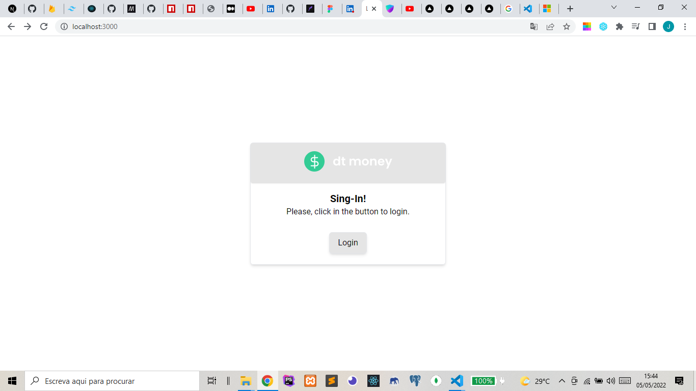
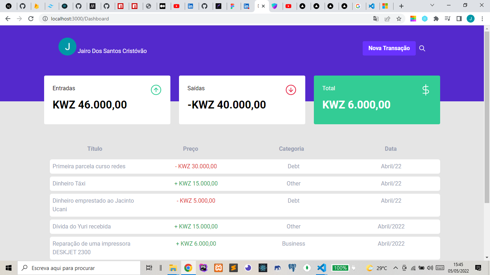
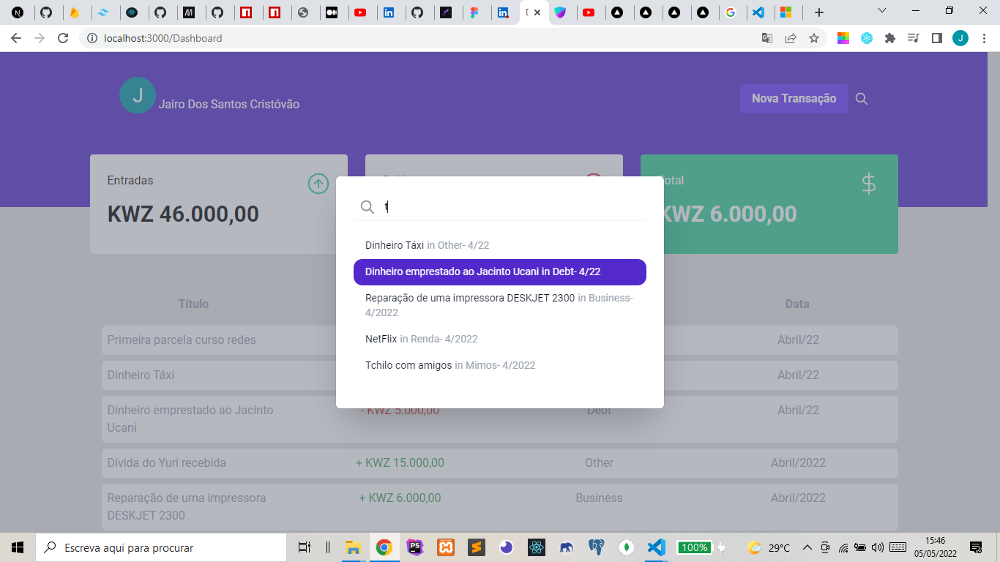
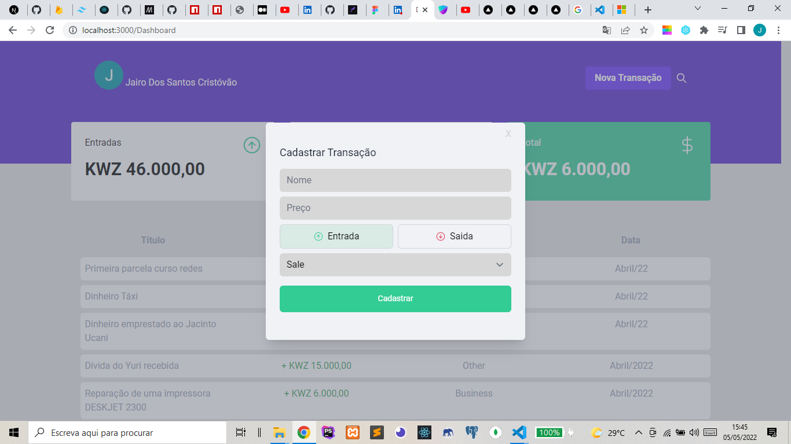
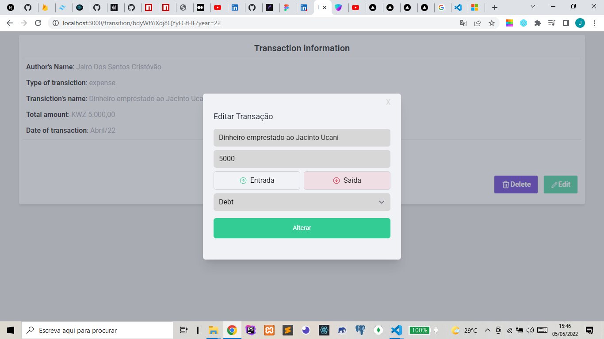

# My Wallet (dt-money)

<div id="top"></div>
<!---Esses são exemplos. Veja https://shields.io para outras pessoas ou para personalizar este conjunto de escudos. Você pode querer incluir dependências, status do projeto e informações de licença aqui--->


<details>
<summary>System Images</summary>
</br>
</br>
</br>
</br>
</br>
</details>

## About The Project

>This project was created in order to challenge me to practice more about Next.js and TailwindCss. The idea to make this project came through a project developed by Diego Fernandes diego3g CTO from RocketSeat (using ReactJS and StyledComent).

Here's why:

* To improve my skills with tailwindCss;
* Learn how to use NextAuth;
* Create something that people can come to use in their daily lives :smile:

<p align="right">(<a href="#top">back to top</a>)</p>

### Adjustments and improvements

The project is still under development and the next updates will focus on the following tasks:

* [x] Allows you to log in with a Google account;
* [x] Register Transaction;
* [x] Allows you to search for a Transaction;
* [x] Allows you to delete a transaction;
* [x] Allows Editing a Transaction;
* [ ] Allow grouping transactions from a given month;
* [ ] Add Other Login Forms.

### Built With

* [Next.js](https://nextjs.org/)
* [TailwindCss](https://tailwindcss.com/)
* [heroicons](https://heroicons.com/)
* [NextAuth](https://next-auth.js.org/)
* [Firebase](https://firebase.google.com/)
* [headlessui](https://headlessui.dev)

<p align="right">(<a href="#top">back to top</a>)</p>

## Getting Started

To get a local copy up and running follow these simple example steps.

### Prerequisites

This is an example of how to list things you need to use the software and how to install them.

* npm

  ```sh
  npm install npm@latest -g
  ```

### Installation

1. Get a free API Key at [https://firebase.google.com/](https://firebase.google.com/)
2. Clone the repo

   ```sh
   git clone https://github.com/JairoDosSantos/dt-money-clone
   ```

3. Make .env.local file

   ```sh
    GOOGLE_ID= PUT YOUR GOOGLE ID HERE
    GOOGLE_SECRET=PUT YOUR GOOGLE SECRET HERE
   ```

4. Install NPM or Yarn packages

   ```sh
   npm install
   ```

   ```sh
   yarn
   ```

<p align="right">(<a href="#top">back to top</a>)</p>

<!-- CONTRIBUTING -->
## Contributing

If you have a suggestion that would make this better, please fork the repo and create a pull request. You can also simply open an issue with the tag "enhancement".
Don't forget to give the project a star! Thanks again!

1. Fork the Project
2. Create your Feature Branch (`git checkout -b feature/SomeFeature`)
3. Commit your Changes (`git commit -m 'Add some SomeFeature'`)
4. Push to the Branch (`git push origin feature/SomeFeature`)
5. Open a Pull Request

<p align="right">(<a href="#top">back to top</a>)</p>

[⬆ Voltar ao topo](#My_Wallet_(dt-money))<br>
